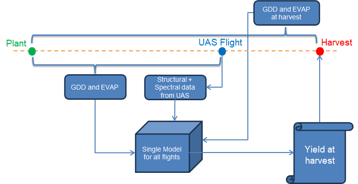

# Table Beets multiseason yield

## **HSI Preprocessing**
* Spectral downsampling by averaging every 3 adjacent bands
* Savitsky Golay filter
* Cut off extremities

## Feature Abbreviations and Definitions

- **gdd**: Growing Degree Days
- **evap**: Accumulated Evapotranspiration
- **vol**: Volume (obtained from SFM)
- **vol_lidar**: Volume (obtained from LiDAR)
- **y**: Beet root yield ($kg/m^2$)

### Naming Conventions

#### Mean Reflectance Spectra
- **Format**: `ref_x_mean_n`
  - `x`: `h` for hyperspectral, `m` for multispectral
  - `n`: Index number (0-79 for HSI, corresponding to wavelengths between 400.80 to 928.35 nm)

#### Spectral Decomposition
- **Format**: `xxx_h_n`
  - `xxx`: Decomposition method (`pca`, `fa`, `ica`, `plsr`)
  - `h`: Indicates hyperspectral data
  - `n`: Band number
  - Note: 3-component decomposition is used as it explains 95% of the variance.

#### Vegetation Indices Spectra
- **Format**: `vi_xxx_h_mean`
  - `xxx`: Vegetation index
  - `h`: Indicates hyperspectral data, `m` for multispectral data

### Notes
- Both spectral decomposition and vegetation indices are calculated from the mean plot reflectance spectra.

## Code
feat_split.py: Spliting the data set into test and train. This follows a split based on plot numbers.
run_gpr_with_feats.py: Runs multiple GPR with various feature combinations and records the performances.

## Schematic of the Model

  

