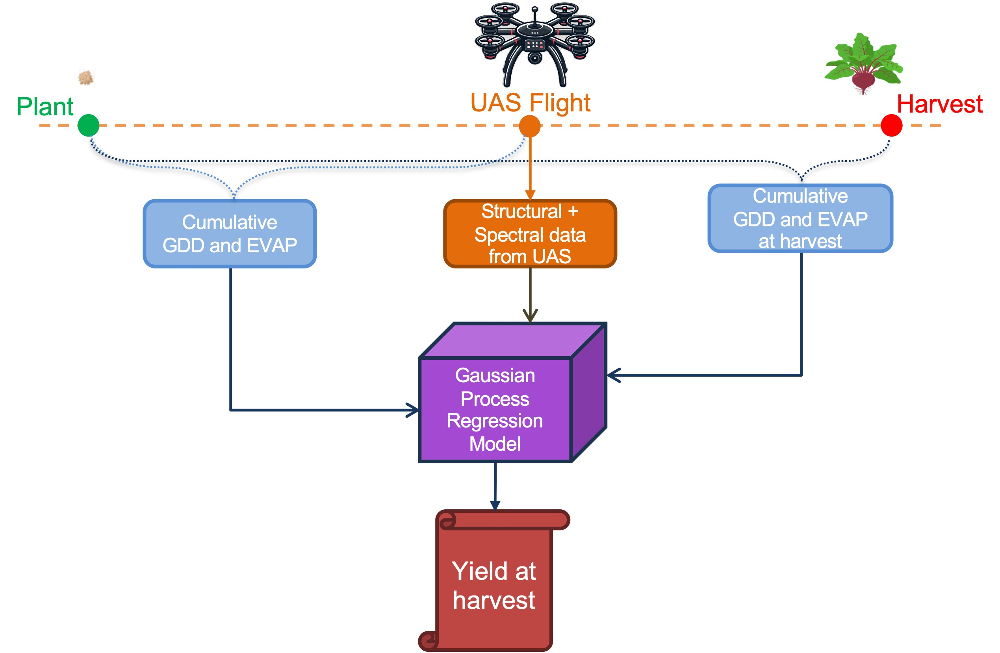

<div align="center">

# Multistage Table Beets yield prediction from unmanned aerial systems

[](https://python.org)

</div>

## 🛠️**Installation**
### Prerequisites
- Python 3.11
- Conda
### Steps
- Clone/download the repository 
- Set up and activate the environment 
- Download the [dataset](https://data.mendeley.com/datasets/d9d5h5xbr5/1) in the directory
```shell
# Downloading the directory
git clone git@github.com:saif8091/yield-multi.git
cd yield-multi

# Setting up environment
conda env create -f environment.yml
conda activate yield_multi
```
**Note**: The data should be downloaded and placed as data directory in the project root. Look [here](#project-structure) for detailed directory structure.
## 🔄**Preprocessing and Vegetation extraction**
Run the following code:
```shell
python make.py
```
This code zips the images, performs preprocessing (HSI only) and then extracts the vegetation from the croped plot images.

### **HSI Preprocessing**
* Spectral downsampling by averaging every 3 adjacent bands
* Savitsky Golay filter
* Cut off extremities

## 📊 **Feature generation**
```shell
python gen_feat.py
```
This code generates different types of features of each plot and compiles them in a csv file and can be found [here](data/preprocessed/features_21_22.csv).

### Feature Abbreviations and Definitions

- **gdd**: Growing Degree Days
- **evap**: Accumulated Evapotranspiration
- **vol**: Volume (obtained from SFM)
- **vol_lidar**: Volume (obtained from LiDAR)
- **y**: Beet root yield ($kg/m^2$)

### Naming Conventions

#### Mean Reflectance Spectra
- **Format**: `ref_x_mean_n`
  - `x`: `h` for hyperspectral, `m` for multispectral
  - `n`: Index number (0-79 for HSI, corresponding to wavelengths between 400.80 to 928.35 nm)

#### Spectral Decomposition
- **Format**: `xxx_h_n`
  - `xxx`: Decomposition method (`pca`, `fa`, `ica`, `plsr`)
  - `h`: Indicates hyperspectral data
  - `n`: Band number
  - Note: 3-component decomposition is used as it explains 95% of the variance.

#### Vegetation Indices Spectra
- **Format**: `vi_xxx_h_mean`
  - `xxx`: Vegetation index
  - `h`: Indicates hyperspectral data, `m` for multispectral data

### Notes
- Both spectral decomposition and vegetation indices are calculated from the mean plot reflectance spectra.

### **Feature filtering**
```shell
python -m feature_filter.filter.py
```
This is code is run to find the relevant spectral features. The filtered feature can be found [here.](feature_filter/filtered_features)

## 🧪 **Machine Learning Model Tests**
Model schematic:
<p align="center">
  
</p>

### Gaussian Process Regression (GPR)
```shell
python -m model_tests.gpr_score_22
```
Trains and outputs GPR model scores at different feature combinations for the 2022 dataset. The scores can be found [here.](model_files/model_scores)

### Random Forest (RF)
```shell
python -m model_tests.rf_score_22
```
Trains and evaluates Random Forest models with hyperparameter tuning.

### XGBoost
```shell
python -m model_tests.xgb_score_22
```
Trains and evaluates XGBoost models with hyperparameter tuning.

### Support Vector Regression (SVR)
```shell
python -m model_tests.svr_score_22
```
Trains and evaluates Support Vector Regression models with hyperparameter tuning.

### Partial Least Squares Regression (PLSR)
```shell
python -m model_tests.plsr_score_22
```
Trains and evaluates PLSR models with hyperparameter tuning.

### Model Transferability Testing
To test for transferability to 2021 test set run the following code:
```shell
python -m model_tests.gpr_testing_21
```
To visualise the result open this [notebook.](model_tests/visualising_performance.ipynb)

## 📈 **Model Performance and Interpretation**
Open [model_performance.](model_performance.ipynb)

## 📁 **Project Structure**
```
yield-multi/
├── data/                                # Main data directory
│   ├── 2021_data.xlsx                   # Field measurements from 2021 growing season
│   ├── 2022_data.xlsx                   # Field measurements from 2022 growing season
│   ├── all_weather_data.csv             # Meteorological data from weather station
│   ├── hyper/                           # Hyperspectral imagery
│   │   ├── 2021/                        # 2021 growing season data
│   │   │   └── YYYYMMDD/                # Date-organized folders
│   │   │       └── x_YYYYMMDD.tif       # Plot images (x = plot number)
│   │   └── 2022/                        # 2022 growing season data
│   │       └── YYYYMMDD/                # Date-organized folders
│   │           ├── disease_grid_yield_2022/  # LBRN12Disease location
│   │           ├── lovebeets_grid_2022/      # LBRN12EAST location
│   │           └── UV_efficacy_2022/         # LBRN12WEST location
│   │               └── x_YYYYMMDD.tif   # Plot images
│   ├── multi/                           # Multispectral imagery (same structure as hyper/)
│   ├── structure/                       # Canopy height models
│   │   ├── chm/                         # CHMs from structure from motion (same structure as hyper/)
│   │   └── chm_lidar/                   # CHMs from LiDAR (same structure as hyper/)
│   ├── preprocessed/                    # Processed data files
|   |   ├── decomposer/                  # Directory for storing decomposition models
│   │   ├── features_21_22.csv           # Compiled features from plots
│   │   └── various .pkl files           # Pickled data objects
│   └── ReadMe.md                        # Dataset documentation
├── data_load/
|   ├── all_data_load.py                 # Script for loading all types of data
|   ├── gt_data_load.py                  # Script for loading ground truth data
|   └── wt_data_load.py                  # Script for loading weather data
├── feature_filter/
│   ├── filtered_features/               # Directory containing filtered features                      
│   ├── feat_filter_cfs.py               # feature filtering through correlation
│   ├── feat_filter_mfs.py               # feature filtering through mutual information
│   ├── feat_filter_micorfs.py           # feature filtering using combination correlation and mutual information
│   ├── feature_selection.py             # feature selection function
|   └── filter.py                        # Implementation of feature filtering
├── feature_formation/                   
|   ├── feat_split_ratio.py              # Contains the ratio for spliting features
|   ├── feat_split.py                    # Script for spliting the dataset into train and test
│   └── hsi_decomposer.py                # Functions for hyperspectral image decomposition
├── figures/                             # Figures and visualizations
│   └── model_schematic.jpg              # Schematic diagram of the model
├── model_files/                         # Model files directory
│   ├── gpr_model_func.py                # GPR model functions
│   ├── rf_model_func.py                 # Random Forest model functions
│   ├── xgb_model_func.py                # XGBoost model functions
│   ├── svr_model_func.py                # SVR model functions
│   ├── plsr_model_func.py               # PLSR model functions
│   ├── mlp_model_func.py                # MLP model functions
│   ├── load_feats.py                    # Feature loading utilities
│   └── model_scores/                    # Directory containing model score outputs
├── model_tests/                         # Model testing scripts
│   ├── gpr_score_22.py                  # GPR model scoring for 2022 data
│   ├── rf_score_22.py                   # Random Forest model scoring for 2022 data
│   ├── xgb_score_22.py                  # XGBoost model scoring for 2022 data
│   ├── svr_score_22.py                  # SVR model scoring for 2022 data
│   ├── plsr_score_22.py                 # PLSR model scoring for 2022 data
│   ├── mlp_score_22.py                  # MLP model scoring for 2022 data
│   ├── gpr_testing_21.py                # GPR model testing for transferability to 2021
│   ├── visualising_performance.ipynb    # Notebook for visualizing model performance
│   └── model_schematic.jpg              # Visual representation of the model
├── preprocess/                          # Preprocessing scripts
│   └── zip_im.py                        # Script for zipping images into dictionaries
├── src/                                 # Source code directory
│   ├── utils.py                         # Utility functions for data processing
│   └── misc.py                          # Miscellaneous helper functions
├── environment.yml                      # Conda environment definition file
├── make.py                              # Script for preprocessing and vegetation extraction
├── gen_feat.py                          # Script for generating features
├── model_performance.ipynb              # Notebook for model performance analysis
└── README.md                            # Project documentation
```